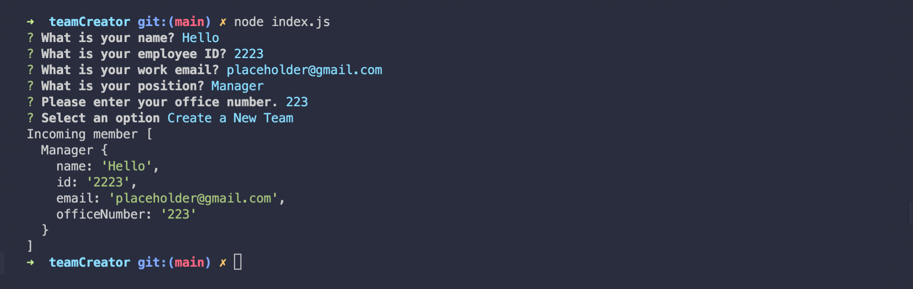

   <h1 align ="center">TeamCreator<h1>

## Description
Application that creates a team layout with Intern, Engineer, and Manager roles. It is perfect for managing the workflow and keeping track of the team.
 

 
Here is a Demonstration of the application:
 
[showcase](./src/overview.gif)
 

# Table of Contents
* [Description](#description)
* [Technologies](#technologies)
* [Installation](#installation)
* [License](#license)
* [Contributions](#contributions)
* [Github](#github)

## Technologies

<li>Js</li>
<li>HTML</li>
<li>CSS</li>
<li>Node</li>
<li>NPM</li>

## Installation
npm init & npm i 

## License

 
This Project is licensed under the MIT license.

## Contributions
Yahir F

## Github
Questions? 
Contact me through my github 
 
[Github](https://github.com/Yahir-F): Yahir-F
 

Email: placeholder@gmail.com

    